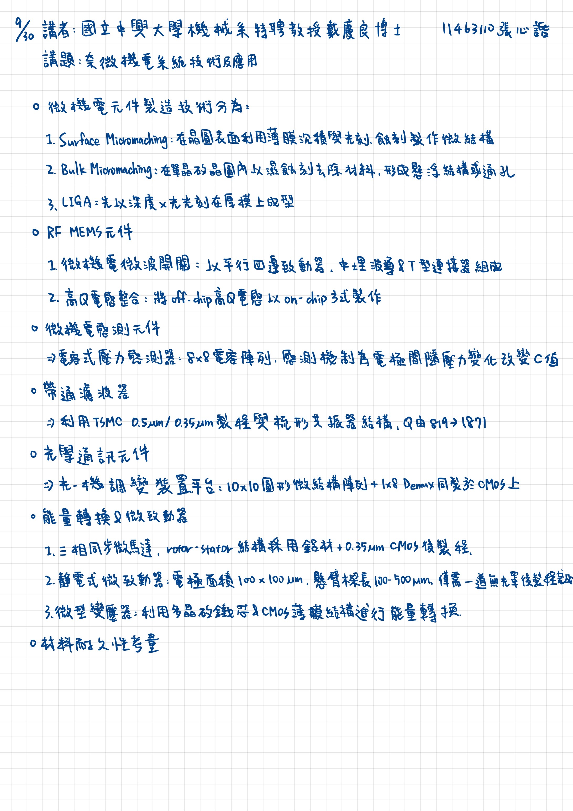

2025/09/30 書報討論重點整理
===
11463110 張心䛡  
講者：國立中興大學機械系特聘教授 戴慶良 博士  
講題：奈微機電系統技術及應用
---

## 重點整理

* 微機電元件製造技術分為：
    1. Surface Micromachining：在晶圓表面利用薄膜沉積與光刻、蝕刻製作微結構，優點是製程與 CMOS 相容度高，適合製作細微三維結構。
    2. Bulk Micromachining：直接在單晶矽晶圓內部以濕蝕刻或乾蝕刻去除材料，形成懸浮結構或通孔，適用於需要大體積變形的元件。
    3. LIGA（電鑄－注塑－壓縮成形）：先以深度 X 光光刻在厚膜上成型，再經金屬電鑄及模塑複製，能製作高縱橫比、金屬微結構，常用於高精度微流體與機械元件。
* RF MEMS元件
    1. 微機電微波開關：以平行四邊致動器、中埋波導及T型連接器組成，具低插入損失、高隔離度特性，可取代現有電子式開關。
    2. 高Q電感整合：將off-chip高Q電感器（Q≈500–1500）以on-chip方式製作，大幅提升系統積集度並降低成本。

* 微機電感測元件
    * 電容式壓力感測器：8×8電容陣列，後製程包含RIE乾蝕刻、濕蝕刻與PECVD氮化矽封裝，感測機制為電極間距隨壓力變化而改變電容量。

* 帶通濾波器（Band-Pass Filter）
    * 利用TSMC 0.5μm/0.35μm製程與梳形共振器結構，實驗中心頻率≈13.1 kHz，Q值由819提升至1871，展現優異品質因數改善效果。

* 光學通訊元件
    * 光－機調變裝置平台：10×10圓形微結構陣列與1×8 Demux電路同製於CMOS晶片上，適用於OADM/OXC、free-space光連結系統。

* 能量轉換與微致動器
    1. 微馬達：三相同步微馬達（直徑≈100 μm）， rotor–stator結構採用鋁材與0.35 μm CMOS後製程。
    2. 靜電式微致動器：電極面積100 μm×100 μm、懸臂樑長100–500 μm，驅動電壓13 V，僅需一道無光罩後製程即可完成。
    3. 微型變壓器：利用多晶矽鐵芯與CMOS薄膜結構進行能量轉換。

* 材料耐久性考量：CMOS製程薄膜多為金屬／氧化物堆疊，量產前需評估耐久性與殘留應力，並可利用矽底材轉植或多晶矽犧牲層特性優化結構釋放。

