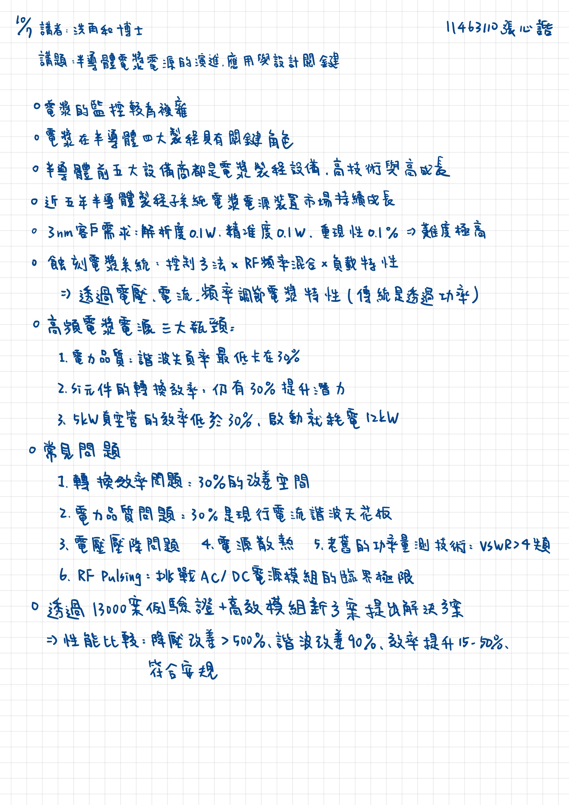

2025/10/07 書報討論重點整理
===
11463110 張心䛡  
講者：呈睿國際公司 洪再和 總經理  
講題：半導體電漿電源的演進、應用與設計關鍵
---

## 重點整理

* 電漿的監控較為繁雜
* 電漿在半導體四大製程具有關鍵角色
* 半導體前五大設備商都是電漿製程設備，高技術與高成長
* 近五年半導體製程子系統電漿電源裝置市場持續成長
* 3nm客戶需求：解析度0.1W、精準度0.1W、重現性0.1%→難度極高
* 蝕刻電漿系統：控制方法×RF頻率混合×負載特性→透過電壓、電流、頻率調節電漿特性(傳統是透過功率)
* 高頻電漿電源三大瓶頸：
    1. 電力品質：諧波失真率最低卡在30%
    2. 矽元件的轉換效率：仍有30%提升潛力
    3. 5kW真空管的效率低於30%、啟動就耗電12kW
* 常見問題：
    1. 轉換效率問題：30%的改善空間
    2. 電力品質問題：30%是現行電流諧波天花板
    3. 電壓壓降問題
    4. 電源散熱
    5. 老舊的功率量測技術：VSMR>4就失真
    6. RF Pulsing：挑戰AC/DC電源模組的臨界極限
* 透過13000案例驗證+高校模組新方案提出解決方案→性能比較：降壓改善>500%、諧波改善90%、效率提升15-50%、符合安規

