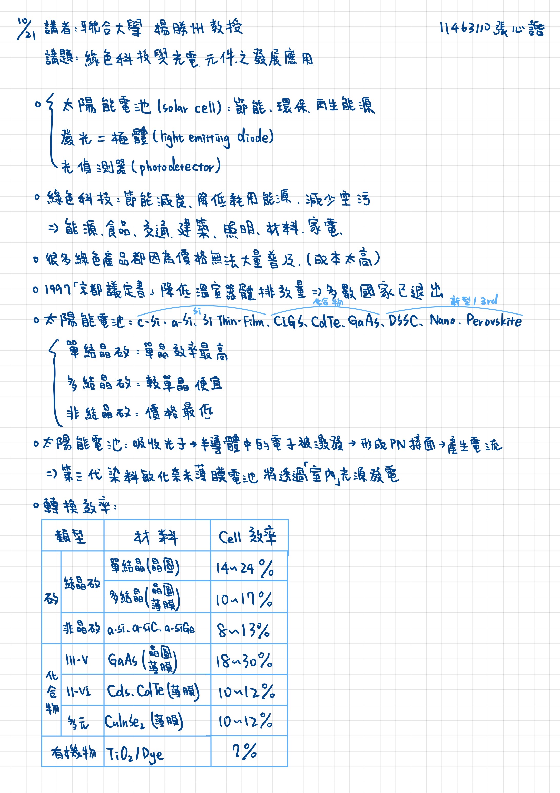

2025/10/21 書報討論重點整理
===
11463110 張心䛡  
講者：聯合大學 楊勝州 教授
講題：綠色科技與光電元件之發展應用
---

## 重點整理

* 綠色科技的應用
    * 太陽能電池(solar cell)：節能、環保、再生能源
    * 發光二極體(light emitting diode)
    * 光偵測器(photodetector)
* 綠色科技：節能減碳、降低耗用能源、減少空污 
    =>能源、食品、交通、建築、照明、材料、家電
* 很多綠色科技產品都是因為價格無法大量普及(成本太高)
* 1997「京都議定書」降低溫室氣體排放量=>多數國家已退出
* 太陽能電池：
    * 材料：c-Si, a-Si, Si Thin-Film, CIGS, CdTe, GaAs, DSSC, Nano, Perovskite
    * 單結晶矽：單晶效率最高
    * 多結晶矽：較單晶便宜
    * 非結晶矽：價格最低
* 太陽能電池：吸收光子->半導體中的電子被激發->形成PN接面->產生電流
    =>第三代染料敏化奈米薄膜電池將透過「室內」光源發電
* 轉換效率  

    | 類型 | 材料 | Cell 效率 |
    |------|------|------------|
    | 矽：結晶矽 | 單結晶(晶圓) | 14~24% |
    | 矽：結晶矽 | 多結晶(晶圓、薄膜) | 10~17% |
    | 矽：非晶矽 | a-Si, a-SiC, a-SiGe | 8~13% |
    | 化合物：III-V | GaAs(晶圓、薄膜) | 18~30% |
    | 化合物：II-VI | CdS, CdTe(薄膜) | 10~12% |
    | 化合物：多元 | CuInSe2(薄膜) | 10~12% |
    | 有機物 | TiO2/Dye | 7% |

