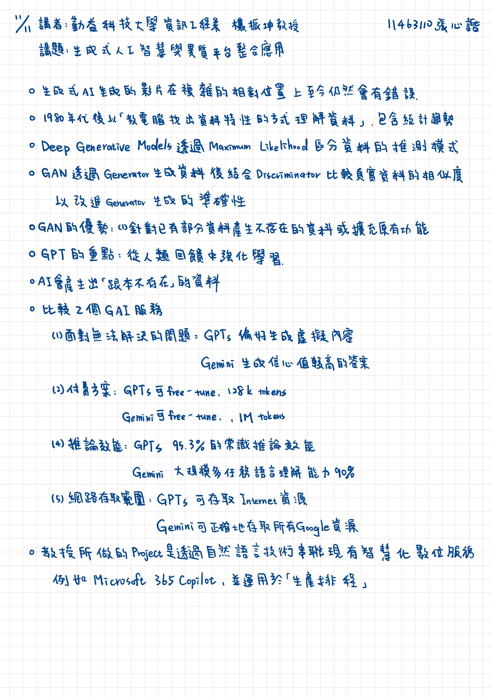

2025/11/11 書報討論重點整理
===
11463110 張心䛡  
講者：勤益科技大學資訊工程系 欉振坤 教授
講題：生成世人工智慧與異質平台整合應用
---

## 重點整理

* 生成式AI生成的影片在複雜的相對位置上至今仍然會有錯誤
* 1980年代後以「教電腦找出資料特性的方式理解資料」，包含統計趨勢
* GAN透過Generator生成資料後結合Discriminator比較真實資料的相似度以改進Generator生成的準確性
* GAN的優勢：針對已有部分資料產生不存在的資料或擴充原有功能
* GPT的重點：從人類回饋中強化學習
* AI會產生出「根本不存在」的資料
* 比較兩個GAI服務
    1. 面對無法解決的問題：GPTs偏好生成虛擬內容、Gemini生成信心值較高的答案
    2. 付費方案：GPTs可free-tune，128 token、Gemini可free-tune，1M token
    3. 推論效能：GPTs 95.3%的常識推論效能、Gemini大規模多任務語言理解能力90%
    4. 網路存取範圍：GPTs可存取Internet資源、Gemini可正確地存取所有Google資源
* 教授所做的Project是透過自然語言技術串聯現有智慧化數位服務，例如Microsoft 365 Copilot，並運用於「生產排程」

