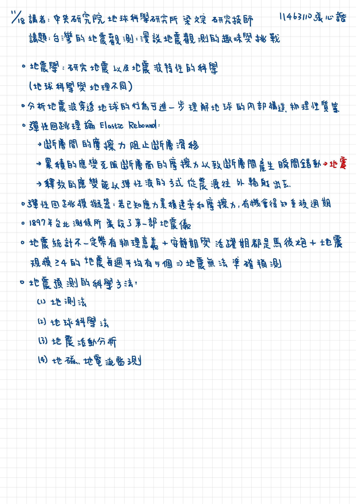

2025/11/18 書報討論重點整理
===
11463110 張心䛡  
講者：中央研究院地球科學研究所 梁文宗 研究技師
講題：台灣的地震觀測：漫談地震觀測的趣味與挑戰
---

[書面報告](20251118書報討論書面報告.pdf)

## 重點整理
* 地震學:研究地震以及地震波特性的科學(地球科學與地理不同)
* 分析地震波穿透地球的行為可進一步理解地球的内部構造、物理性質等
* 彈性回跳理論 Elastic Rebound:
    * 斷層間的摩擦力阻止斷層滑移
    * 累積的應變克服斷層面的摩擦力以致斷層間產生瞬間錯動→地震
    * 釋放的應變能以彈性波的方式從震源往外輻射出去。
* 彈性回跳模擬器：若已知應力累積速率和摩擦力，有機會得知重複週期
* 1897年台北測候所装設了第一部地震儀
* 地震統計不一定帶有物理意義+安靜期與活躍期都是馬後炮+地震規模>=4的地震每週平均有5個=>地震無法準確預測
* 地震預測的科學方法
    * 地測法：利用GPS或大地測量技術持續監測斷層與地殼變形，觀察是否有異常變動，作為地震前兆的參考。
    * 地球科學法：量測地下水、土壤或大氣中氣體（如氡、二氧化碳）濃度的變化，部分學者認為大地震前會觀察到異常。
    * 地震活動分析：長期記錄與分析區域內的小規模地震活動與其模式，嘗試發現前震或異常的震群作為警示。
    * 地磁、地電流監測：觀測地磁場及電流變化，研究證實震前斷層運動可能出現異常電磁信號。

