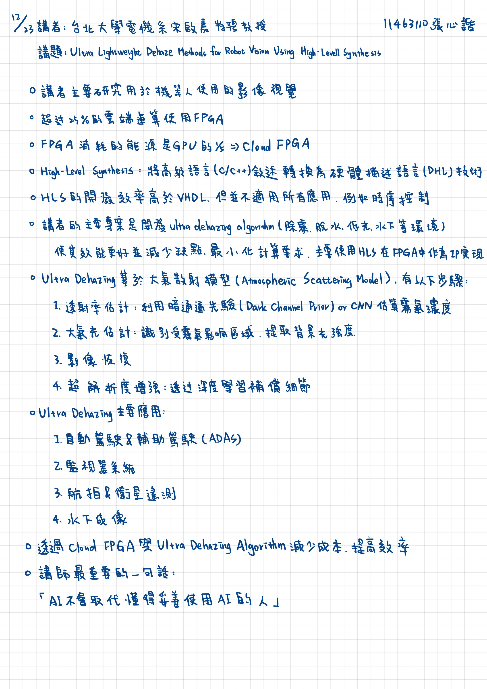

2025/12/23 書報討論重點整理
===
11463110 張心䛡  
講者：台北大學電機系宋啟嘉特聘教授
講題：Ultra Lightweight Dehace Methods for Robot Vision Using High-Level Synthesis
===

## 重點整理
* 講者主要研究用於機器人使用的影像視覺
* 超過25%的雲端運算使用FPGA
* FPGA消耗的能源是GPU的1/5=>Cloud FPGA
* High-Level Synthesis：將高級語言（c/c++）敘述轉換為硬體描述語言（DHL）技術
* HLS的開發效率高於VHDL，但並不適用所有應用、例如時序控制
* 講者的主要專案是開發ultra dehazing algorithm（除霧、脫水、低光、水下等環境）使其效能更好並減少缺點、最小化計算要求，主要使用HLS在FPGA中作為IP實現
* Ultra Dehazing基於大氣散射模型（Atmospheric Scattering Model），有以下步驟：
    1. 透射率估計：利用暗通道先驗（Dark Channel Prior）or CNN估算霧氣濃度
    2. 大氣光估計：識別受霧氣影響區域，提取背景光強度
    3. 影像恢復
    4. 超解析度增強：透過深度學習補償細節
* Ultra Dehazing主要應用：
    1. 自動駕駛&輔助駕駛（ADAS）
    2. 監視器系統
    3. 航拍&衛星遙測
    4. 水下成像
* 透過cloud FPGA與 Ultra Dehazing Algorithm減少成本、提高效率
* 講師最重要的一句話：
    * 「AI不會取代懂得妥善使用AI的人」

